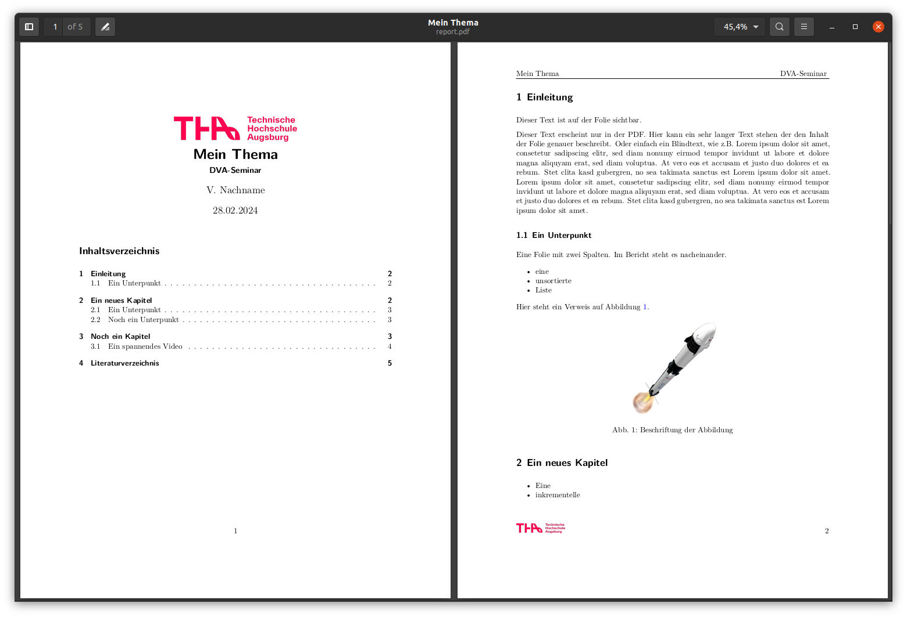
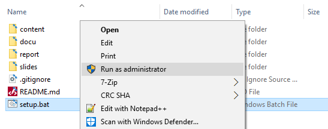

# Quarto THA

Quarto THA für ansprechende .html Slides und automatischen LaTex report.

- [Content: Der eigentliche Inhalt](content/content.qmd)
- [Slides: .html slides](slides/slides.qmd)
- [Report: .pdf report](report/report.qmd)

{width=50%}

{width=50%}

## Quarto
[Quarto](https://quarto.org/) ist in Open-Source-System für wissenschaftliches und technisches Publizieren:

- Verfasse Inhalte mit Jupyter-Notebooks oder Markdown im bevorzugten Editor
- Erstelle dynamische Inhalte mit Python, R, Julia und Observable
- Veröffentliche reproduzierbare, qualitativ hochwertige Artikel, Präsentationen und mehr in HTML, PDF, MS Word oder ePub
- Teile Wissen unternehmensweit durch Publikation auf Posit Connect, Confluence oder anderen Systemen
- Nutze Pandoc-Markdown für das Schreiben, inklusive Gleichungen, Zitaten, Querverweisen, Abbildungspaneelen, Callouts und fortgeschrittenem Layout

## Quarto Installation

Eine ausführliche Anleitung zur Installation auf allen gängigen Plattformen gibt es [hier](https://quarto.org/docs/get-started/).

- Das Erstellen von Folien ist ohne weitere Software möglich. 
- Zum Erstellen von LaTex Dokumenten muss eine Tex Version installiert sein, z.B. [TexLive](https://www.tug.org/texlive/).

## Quarto THA Setup
Git checkout mit:

```console
git clone https://gitlab.informatik.hs-augsburg.de/mis18bh/quarto_tha
```

[slides.qmd](slides/slides.qmd) und [report.qmd](report/report.qmd) binden die Inhalte aus [content.qmd](report/content.qmd) ein. Damit gemeinsame Ressourcen (images und references.bib) effizient genutzt werden können, müssen jeweils symbolische Verknüpfungen erstellt werden. 

Auf Linux:

```console
bash ./setup.bash
```

Auf Windows mit Rechtsklick auf `setup.bat` auf Ausführen als Administrator:

{width=50%}